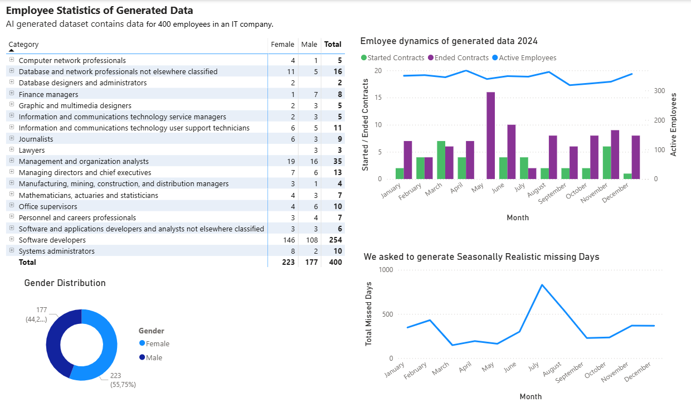

# Salary Management Report - Solution Analysis
## Table of Contents
- [Purpose of the Data Analysis](#purpose-of-the-data-analysis)
- [Glossary of Terms](#glossary-of-terms)
- [Data Protection](#data-protection)
- [Data Model](#data-model)
  - [Contract Table](#contract-table)
  - [Salary Table](#salary-table)
  - [Monthly Workdays Table](#monthly-workdays-table)
- [Description of output](description-of-output)
- [Generation of Dummy data](generation-of-dummy-data)

## Purpose of the Data Analysis

The objective of this data analysis is to create a **user-friendly analysis tool for HR staff**. This involves making salary and benefits structures understandable to employees and managers, allowing comparisons across categories, levels, and gender. The aim is to support a fair and transparent salary policy.

Improving pay transparency helps build **trust**, supports **equitable pay practices**, and enables informed decision-making for both employees and management.

## Data Model

### Contract Table
Contains Contract data. Data about needed dimensions - position category, position level and contract period. Included detail data to enable data drill down.

| Field Name   | Data Type     | Key / Relation               | Description                                                                 |
|--------------|--------------|------------------------------|-----------------------------------------------------------------------------|
| EmployeeID   | Long Integer | FK → Employee.EmployeeID (*) | Link to Employee table (not represented in data model).                     |
| ContractID   | Long Integer | PK                           | Primary key of the contract.                                                |
| FullName     | Text    |                              | Employee’s full name.                                                       |
| Gender       | Text     |                              | Gender: "Male" or "Female".                                                 |
| StartDate    | Date   |                              | Contract start date.                                                        |
| EndDate      | Date    |                              | Contract end date (may be empty/null).                                      |
| Position     | Text   |                              | Employee position.                                                          |
| Category     | Text    |                              | Position category.                                                          |
| Level        | Text    |                              | Position level.                                                             |
| Workload     | Number (Real) |                           | Workload as a fraction of full position (0 – 1).                          |

### Salary Table 
Contains data of monthly payroll and working days

| Field Name         | Data Type        | Key / Relation                 | Description                                                                 |
|--------------------|-----------------|--------------------------------|-----------------------------------------------------------------------------|
| ContractID         | Long Integer    | FK → Contract.ContractID       | Foreign key to Contract table.                                              |
| PeriodStart        | Date       |                                | First day of the month.                                                     |
| PeriodEnd          | Date       | FK → Monthly Workdays.Month                                | Last day of the month.                                                      |
| ActualWorkingDays  | Integer         |                                | Number of days worked in the month.                                         |
| Salary             | Decimal         |                                | Base salary amount for the month.                                           |
| Benefit            | Decimal         |                                | Benefits/bonuses paid in the month.                                         |
| MissedDays         | Integer         |                                | Number of missed workdays (vacation, sick leave, etc.).                     |
| FullSalary         | Calculated      |                                | `[Salary] + [Benefit]`.                                                     |

### Monthly Workdays Table 
Contains number of working days and working hours for each month

| Field Name         | Data Type        | Key / Relation                 | Description                                                                 |
|--------------------|-----------------|--------------------------------|-----------------------------------------------------------------------------|
| Month              | Date    | PK       | Last day of the month                                              |
| Working days        | integer       |                      | number of working days of the month.                                                     |
| Hours          | integer       |                           | Number of working hours of the month.                                                      |

## Glossary of Terms

**Base Salary** – the employee’s monthly base salary (excluding allowances or bonuses).  

**Benefit** or **Variable pay** – the variable salary paid to an employee (e.g. bonus, overtime allowance).  

**Monthly Salary** – the employee’s total monthly pay, including base salary and allowances.  

**Full-Time Monthly Salary** or **Monthly salary**  – the monthly salary of a full-time employee.  

**Average Salary** – the average monthly salary of a full-time employee over the selected period.  

**Group Average Salary** – the average salary of employees within a group (e.g. department, job category).  

**Group Median** – the median of employees’ monthly salaries within a group, representing the typical pay level (not affected by exceptionally high or low salaries).  

**Salary Range** – the minimum and maximum values of average monthly salaries within a group.  

**Gender Pay Gap** – the difference between men’s and women’s average salaries, expressed as a percentage of men’s average salary. 

**Category** – a group of job positions that share similar functions or job family within the organization.Each category may include multiple job titles at different levels of seniority.

**Level** – indicates the seniority or experience of a position within a category.

## Data Protection
- The HR department decides on the sharing of outputs.  
- HR staff using the reports may access all detailed data.  
- Final outputs are not produced for groups with fewer than 3 individuals.  
- Data may be presented to an employee regarding their own group only.

## Description of Output
- Salary range table by category and Level
- Salary gap analysis graphs and/or tables
- Drill down to source data

## Generation of Dummy Data
For demonstration we generated data with AI (ChatGPT) for 400 employees in an IT company.
- tables for contract data and salary data as described in data model
- data for year 2024
- workload mainly 1, sometimes 0.5, rarely 0.75.
- women and men salary should have small pay gap within the same job position category 
- the contract table have employees with changed contractual conditions (position, category, level of position) and some employees who have started to work in 2024 and some employees who have left the company in year 2024. End date should be mostly empty
- generate missed days realistically taking estonian seasionality into account and calculate smaller salaries proportionally
- create one row for each contract for each month taking into account contract start date and end date, actual working days

## Results