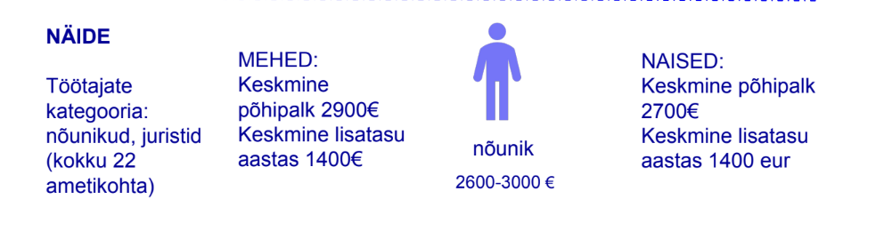

# Intervjuu
## Väljund
_1. Milline on ettekujutus tulemusest?_
- Palglõhe _graafik_ - meeldib scatter plot
- _tabel_ (Näite allikas: Tellija saadetud slaidishow)

- _kas on vaja drilldowni?_ Vaja andmete kontrollimiseks, anomaaliatest arusaamiseks
- _analüüs? võrdlus palgaturuga_ - järgmises etapis. Pole selge kas on võrreldavaid palgakategooriaid
- väljund peaks olema aasta kohta
- teeme näite 400 töötajaga ettevõtte kohta
- eesmärk: regulaarne palgalõhe ülevaatus
- eesmärk 2: palgavahemike välatöötamine. palkade avalikustamine, töötaja peab saama vastuse oma palgakategooria kohta. Võimalus esitada palgavahemikke töökuulutuse avaldamisel. Tööintervjuul ei tohi küsida tema palga ajaloo kohta. 

2.	_Milline informatsioon peaks olema kindlasti kajastatud?_
- palgavahemik (miinimum ja maksimum)

3.	_Soolise palgalõhe analüüs vahemike või kindlate arvude/palkade põhjal? Mis näitajad on vaja välja tuua?_
- palgalõhe keskmise palga põhjal. Palgalehe põhjendamist võimaldavad andmed (palgalõhe analüüs ametikohtade lõikes, drill-down)

4.	_Millest veel palgatase sõltub? Mille põhjal, üleüldine? Nt piirkond, tase, kogemused, vanus?_ leppisime kokku: tööpere (ametikoha kategooria), tase (juunior, kesktase, seenior)
    _Meie andmete põhjal, mis mõjutavad palgataset kõige rohkem?_ sellest ei rääkinud
5.	_Palgalõhe olemasolul, kas seda on vaja veel eraldi analüüsida? Ootused?_
6.  _Palgavahemike võrdlus BCS Koolitus vs turul toimuv_ jätame järgmisse etappi, kui aega jääb. vaja ametikohtade vastavust statistiliste palgakategooriatega

## Andmed
1. _Millised andmed on?_
- töötaja
- palk

2. _Tööpered ja tasandid antud ettevõttes?_

**tööpere** - ametikoha kategooria

**tase** - oskuste taset ja staaži väljendav kategooria

loome it ettevõtte töötajate näidisandmestiku AI abil

3. _Mis andmed on palgalõhe analüüsimiseks?_ keskmine palk

4. _Millist andmestikku kasutada turu võrdluseks? Kuidas siduda ettevõtte ja turu andmeid?_ eespool käsitletud