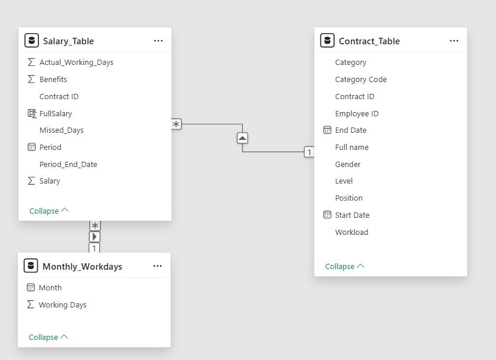

# Salary Managegement Report Solution Analysis
## Data model
### Contract Table
Contains Contract data. Data about needed dimensions - position category, position level and contract period. Included detail data to enable data drill down.
Employee ID -FK to employee table, not represented in data model
Contract ID - Primary key
Full Name - Employee full name
Gender - Male/Female
start date - Contract start date
End date - Contract end date, may be empty
Position - Employee position
Category - Position Category
Level - Position level
Workload - percent of full position, between 0 and 1

| Field Name   | Data Type     | Key / Relation               | Description                                                                 |
|--------------|--------------|------------------------------|-----------------------------------------------------------------------------|
| EmployeeID   | Long Integer | FK → Employee.EmployeeID (*) | Link to Employee table (not represented in data model).                     |
| ContractID   | Long Integer | PK                           | Primary key of the contract.                                                |
| FullName     | Text (255)   |                              | Employee’s full name.                                                       |
| Gender       | Text (10)    |                              | Gender: "Male" or "Female".                                                 |
| StartDate    | Date/Time    |                              | Contract start date.                                                        |
| EndDate      | Date/Time    |                              | Contract end date (may be empty/null).                                      |
| Position     | Text (100)   |                              | Employee position.                                                          |
| Category     | Text (100)   |                              | Position category.                                                          |
| Level        | Text (50)    |                              | Position level.                                                             |
| Workload     | Number (Double) |                           | Workload as a fraction of full position (0.0–1.0).                          |

### Salary table 
Contains data of monthly payroll and working days

| Field Name         | Data Type        | Key / Relation                 | Description                                                                 |
|--------------------|-----------------|--------------------------------|-----------------------------------------------------------------------------|
| ContractID         | Long Integer    | FK → Contract.ContractID       | Foreign key to Contract table.                                              |
| PeriodStart        | Date/Time       |                                | First day of the month.                                                     |
| PeriodEnd          | Date/Time       |                                | Last day of the month.                                                      |
| ActualWorkingDays  | Integer         |                                | Number of days worked in the month.                                         |
| Salary             | Decimal         |                                | Base salary amount for the month.                                           |
| Benefit            | Decimal        |                                | Benefits/bonuses paid in the month.                                         |
| MissedDays         | Integer         |                                | Number of missed workdays (vacation, sick leave, etc.).                     |
| FullSalary         | Calculated      |                                | `[Salary] + [Benefit]`.                                                     |

- töötajate/töölepingute andmed
- ettevõtte struktuur
- ?tööturu andmed

### mõõdikud

## mõisted
- palk
- palgavahemik
- tööpere
- tasandid
- palgalõhe
- piirkond\asukoht
- läbipaistvus
## andmekaitse
- Väljundite jagamise üle otsustab personaliosakonna töötaja
- Personaliaosakonna töötaja, kes raporteid kasutab, võib näha kõiki detailandmeid
- Me ei loo lõppväljundeid nende gruppide kohta, kus on vähem kui 3 inimest. 
- Andmeid võib esitada töötajale tema grupi kohta

### Detailandmed on
....

## Väljundi kirjeldus
- palgavahemikud
- palgalõhe analüüs
- ? võrdlus tööturuga

## LISA. Andmete genereerimise skript ja chatgpt esitatud tingimused
